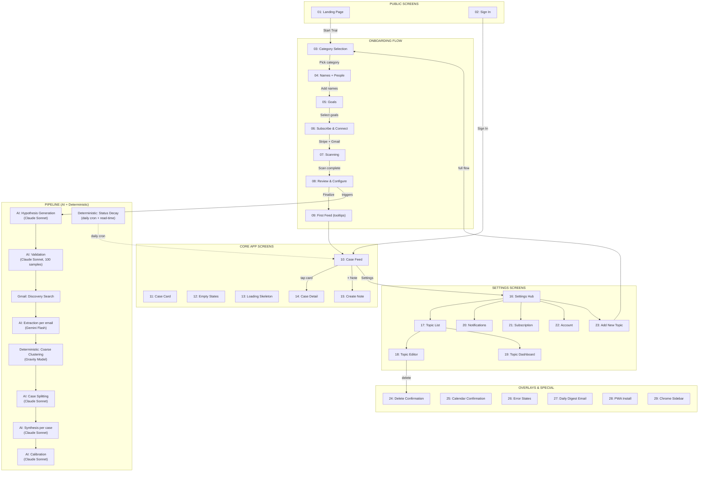
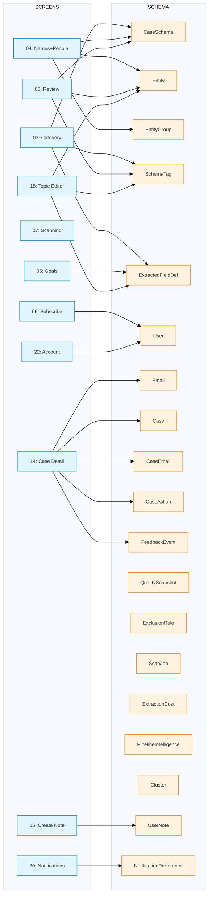

# Screen-to-Schema Data Flow & Completeness Analysis

## Data Flow Diagram



## Screen-to-Schema Write Matrix

Each row shows what schema tables a screen **writes** to (creates or updates). Read-only display is not shown here.



## Pipeline Stage-to-Schema Write Matrix

| Pipeline Stage | Trigger | Model | Schema Tables Written |
|---|---|---|---|
| **Hypothesis Generation** | Screen 08 finalize | Claude Sonnet | CaseSchema (clusteringConfig, summaryLabels, secondaryEntityConfig, discoveryQueries, extractionPrompt, synthesisPrompt) |
| **Validation** | After hypothesis | Claude Sonnet | Entity (confidence updates), CaseSchema (discoveryQueries validated) |
| **Discovery** | After validation | Gmail API search | ScanJob (progress), Email (initial metadata via Gmail) |
| **Extraction** | Per discovered email | Gemini Flash | Email (summary, tags, extractedData, routingDecision, detectedEntities), EmailAttachment, ExtractionCost |
| **Coarse Clustering** | After extraction batch | Deterministic (gravity model) | Cluster, CaseEmail, Case (initial creation) |
| **Case Splitting** | After coarse clustering | Claude Sonnet | Case (refined grouping), CaseEmail (reassignment), Email (discriminators) |
| **Synthesis** | Per case after splitting | Claude Sonnet | Case (title, emoji, mood, summary, displayTags, primaryActor, urgency, status, aggregatedData, actions), CaseAction, ExtractionCost |
| **Calibration** | After synthesis (CALIBRATING/TRACKING phase) | Claude Sonnet | CaseSchema (tunedClusteringConfig, discriminatorVocabulary, qualityPhase) |
| **Status Decay** | Daily cron 6 AM + read-time | Deterministic | Case (urgency, status), CaseAction (status -> EXPIRED) |
| **Quality Snapshot** | Daily cron | Deterministic | QualitySnapshot |
| **Exclusion Auto-Rule** | 3+ excludes from same domain | Deterministic | ExclusionRule |

## Prompt-to-Pipeline Mapping

Which prompt file powers each AI stage, what it receives, and what it produces.

| Stage | Prompt File | Inputs | Outputs |
|---|---|---|---|
| **1. Hypothesis** | `interview-hypothesis.ts` → `buildHypothesisPrompt()` | `InterviewInput`: role, domain, goals, whats[], whos[], groups[], sharedWhos[] | Full `SchemaHypothesis`: entities, tags, extractedFields, summaryLabels, clusteringConfig, discoveryQueries, exclusionPatterns |
| **2. Validation** | `interview-validate.ts` → `buildValidationPrompt()` | `SchemaHypothesis` (entities, tags), `EmailSample[]` (subject, sender, snippet ×100), `EntityGroupContext[]` (paired WHATs+WHOs) | confirmedEntities, discoveredEntities (with alias detection + emailIndices grounding), confirmedTags, suggestedTags, noisePatterns, confidenceScore |
| **3. Discovery Intelligence** | `discovery-intelligence.ts` → `buildDiscoveryIntelligencePrompt()` | domain, entityGroups, top 30 senderPatterns, socialClusters (co-recipients), 15 bodySamples (300-char), existing queries | relevantQueries (Gmail search syntax), excludeDomains |
| **4. Extraction** | `extraction.ts` → `buildExtractionPrompt()` | `ExtractionInput` (full email: subject, sender, body, attachments), `ExtractionSchemaContext` (tags, entities with aliases, entityGroups with scoring rubric, fields, exclusionPatterns), today? | summary, tags[], extractedData{}, detectedEntities[], relevanceScore, relevanceEntity |
| **5. Clustering Intelligence** | `clustering-intelligence.ts` → `buildClusteringIntelligencePrompt()` | domain, entityGroups, emails[] (id, subject, sender, date, summary, tags, entityName), currentConfig (thresholds) | groups[] (caseTitle, emailIds, isRecurring), configOverrides (mergeThreshold, senderAffinityWeight), excludeSuggestions |
| **6. Case Splitting** | `case-splitting.ts` → `buildCaseSplittingPrompt()` | domain, today?, clusters[] (entityName, frequencyWords with weightedScore, emailSamples ×30), correctionHistory?, learnedVocabulary? | cases[] (caseTitle, discriminators, emailIds), catchAllEmailIds |
| **7. Synthesis** | `synthesis.ts` → `buildSynthesisPrompt()` | `SynthesisEmailInput[]` (id, subject, sender, date, isReply, tags, summary), `SynthesisSchemaContext` (domain, tags, entities, fields, summaryLabels), today? | title, emoji, mood, 3-part summary, displayTags, primaryActor, actions[] (with dates, amounts, locations), status, urgency |
| **8. Calibration** | `clustering-calibration.ts` → `buildClusteringCalibrationPrompt()` | currentConfig (thresholds), coarseClusters[] (entityName, emailCount, casesSplit), frequencyTables{}, corrections[] (last 50) | tunedConfig (adjusted thresholds), discriminatorVocabulary (per-entity word→confidence), reasoning |

### Data Flow: What Each Prompt Inherits from Prior Steps

```
Interview Input (user-provided)
  │
  ▼
┌─────────────────────────────┐
│ 1. HYPOTHESIS (Claude)       │  Creates: SchemaHypothesis
│    Reads: role, domain,      │    → entities, tags, fields, clusteringConfig,
│    groups, goals             │      discoveryQueries, summaryLabels
└──────────────┬──────────────┘
               ▼
┌─────────────────────────────┐
│ 2. VALIDATION (Claude)       │  Reads: hypothesis + 100 Gmail samples + entityGroups
│    Confirms/discovers:       │  Writes: confirmedEntities, discoveredEntities
│    entities, tags, noise     │    (with alias detection + emailIndices grounding)
└──────────────┬──────────────┘
               ▼
┌─────────────────────────────┐
│ 3. DISCOVERY (Claude)        │  Reads: domain, entityGroups, sender graph,
│    Generates Gmail queries   │    body samples, existing queries
│    for targeted email scan   │  Writes: relevantQueries[], excludeDomains
└──────────────┬──────────────┘
               ▼
┌─────────────────────────────┐
│ 4. EXTRACTION (Gemini)       │  Reads: full email body + ExtractionSchemaContext
│    Per-email metadata        │    (tags, entities+aliases, entityGroups, fields)
│                              │  Writes: summary, tags, extractedData,
│                              │    detectedEntities, relevanceScore
└──────────────┬──────────────┘
               ▼
┌─────────────────────────────┐
│ 5. CLUSTERING INTEL (Claude) │  Reads: extracted emails + entityGroups + config
│    Pre-cluster grouping      │  Writes: suggested groups, configOverrides
└──────────────┬──────────────┘
               ▼
┌─────────────────────────────┐
│    GRAVITY MODEL (determ.)   │  Reads: emails + clusteringConfig + entities
│    Coarse clustering         │  Writes: Cluster, CaseEmail, Case (initial)
└──────────────┬──────────────┘
               ▼
┌─────────────────────────────┐
│ 6. CASE SPLITTING (Claude)   │  Reads: clusters + freq words + corrections
│    Refines coarse clusters   │    + learnedVocabulary + today
│                              │  Writes: split cases, discriminators
└──────────────┬──────────────┘
               ▼
┌─────────────────────────────┐
│ 7. SYNTHESIS (Claude)        │  Reads: case emails + schema context + today
│    Case enrichment           │  Writes: title, emoji, mood, summary, tags,
│                              │    actions, urgency, status, primaryActor
└──────────────┬──────────────┘
               ▼
┌─────────────────────────────┐
│ 8. CALIBRATION (Claude)      │  Reads: current config + cluster stats +
│    Learning loop             │    corrections + frequency tables
│                              │  Writes: tunedConfig, discriminatorVocabulary
└─────────────────────────────┘
```

## Completeness Audit

### Are all schema tables populated?

| Model | Source | Status |
|---|---|---|
| User | Screen 02 (Sign In), Screen 06 (Stripe + Gmail OAuth), Screen 22 (Account edits) | COMPLETE |
| CaseSchema | Screen 03 (domain), Screen 04 (entities -> primaryEntityConfig, name), Screen 08 (finalize) + Pipeline (hypothesis -> configs, prompts) | COMPLETE |
| SchemaTag | Screen 03 (AI-generated from domain) + Screen 08 (user edits) + Screen 18 (editor) | COMPLETE |
| ExtractedFieldDef | Screen 03 (domain defaults) + Screen 05 (goals -> showOnCard) + Screen 18 (editor) | COMPLETE |
| Entity | Screen 04 (user WHATs + WHOs) + Pipeline validation (auto-discovered) + Screen 08 (toggles) + Screen 18 (editor) | COMPLETE |
| EntityGroup | Screen 04 (pairing of WHATs + WHOs entered together) + Screen 08 (merge interaction) | COMPLETE |
| Email | Pipeline extraction (Gemini Flash per email) | COMPLETE |
| EmailAttachment | Pipeline extraction (discovered during email processing) | COMPLETE |
| Case | Pipeline synthesis (Claude Sonnet per cluster) | COMPLETE |
| CaseEmail | Pipeline clustering (gravity model) + Screen 14 (feedback: email move) | COMPLETE |
| CaseAction | Pipeline synthesis + Screen 14 (mark done/dismiss) | COMPLETE |
| Cluster | Pipeline coarse clustering (audit trail) | COMPLETE |
| FeedbackEvent | Screen 14 (thumbs up/down, email move, exclude, merge, text feedback) | COMPLETE |
| QualitySnapshot | Pipeline daily cron (computed from FeedbackEvent) | COMPLETE |
| ExclusionRule | Pipeline auto-rule (3+ excludes) + Screen 08 (interview-discovered noise) | COMPLETE |
| ScanJob | Pipeline scanning (Screen 07 displays progress) | COMPLETE |
| ExtractionCost | Pipeline (per AI API call) | COMPLETE |
| PipelineIntelligence | Pipeline (AI reasoning audit at each stage) | COMPLETE |
| UserNote | Screen 15 (Create Note) | **NEW MODEL NEEDED** |
| NotificationPreference | Screen 20 (first save creates row) | **NEW MODEL NEEDED** |

**Result: All existing schema models are fully populated. Two new models (UserNote, NotificationPreference) and User Stripe fields need to be added to schema.prisma.**

### Does the AI have enough information at each stage?

| AI Stage | What it receives | What it needs to produce good output | Gap? |
|---|---|---|---|
| **Hypothesis** (Claude) | User role/domain, entity groups (WHATs + WHOs), goals | Tag taxonomy, clustering config, summary labels, fields, discovery queries | NO GAP — domain + entities + goals give enough context |
| **Validation** (Claude) | Hypothesis + 100 email samples (subject, sender, 120-char snippet) | Confirmed entities, discovered entities, suggested tags, noise patterns | MINOR — 120-char snippets are short, but sender+subject compensate |
| **Discovery Intelligence** (Claude) | Domain, entity groups, top 30 senders, social graph (10 co-recipients), 15 body samples (300-char), existing queries | Smart Gmail queries, exclude domains | MINOR — body samples are truncated but combined with sender graph works |
| **Extraction** (Gemini) | Full email body + schema context (tags, entities with aliases, entity groups with scoring rubric, fields, exclusion patterns) | Summary, tags, extractedData, detectedEntities, relevanceScore, routing | **GAP: No today's date** — Gemini can't assess temporal relevance (is this email about something upcoming or long past?) |
| **Case Splitting** (Claude) | Domain, coarse clusters with freq words (20), email samples (30 per cluster), correction history (20), learned vocabulary | Split decisions, titles, discriminator words, emailId assignments | **GAP: No today's date** — can't distinguish past events from upcoming |
| **Calibration** (Claude) | Current clustering config, coarse cluster stats, last 50 corrections, learned vocabulary | Tuned config weights, new discriminator vocabulary | **GAP: Frequency tables are empty `{}`** — prompt expects tag frequency data but receives none |
| **Synthesis** (Claude) | All case emails (subject, sender, date, summary, tags, isReply) + schema context + **today's date** | Title, summary, tags, actions, urgency, mood, emoji, status | NO GAP — best-configured call, has today's date |

### AI Information Gaps (Pre-UX, must fix)

These are documented in `docs/ai-call-audit.md` and `docs/ux-redesign-plan.md` Section 16:

1. **HIGH: Extraction missing today's date** — Add `today` param to `buildExtractionPrompt()`, pass from service
2. **HIGH: Case Splitting missing today's date** — Add `today` param to `buildCaseSplittingPrompt()`, pass from service
3. **MEDIUM: Discovery Intelligence missing Zod validation** — Raw `JSON.parse`, no schema validation on AI response
4. **HIGH: Calibration empty frequency tables** — `frequencyTables: {}` hardcoded in cluster.ts, prompt expects real data
5. **LOW: Full email body in extraction** — No truncation, potential token limit issues on very long emails

**Recommendation:** Fix items 1, 2, and 4 before the UX overhaul (Phase 0). These directly affect case quality which is what users see on every screen.
